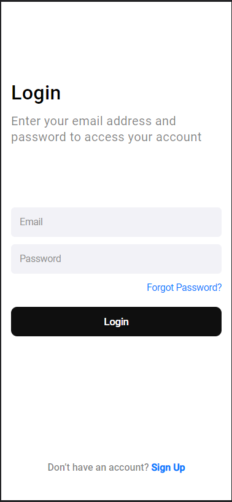

# login-html

> Resultado do projeto de login, do curso CodeClub.

### Ajustes e melhorias

O projeto está finalizado

- [x] Criação do HTML
- [x] Criação do CSS
## 🤝 Colaboradores

Agradecemos às seguintes pessoas que contribuíram para este projeto:

<table>
  <tr>
    <td align="center">
      <a href="https://github.com/mathetheu">
         
        
          <b>Matheus P. Gomes</b>
        
      </a>
    </td>

  </tr>
</table>

[⬆ Voltar ao topo](#yoga-interface) 
